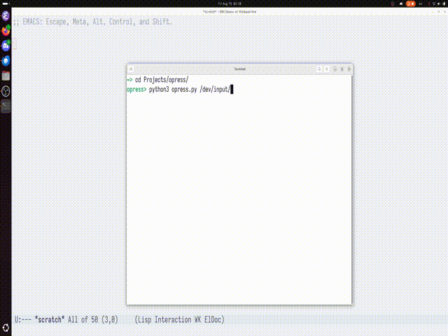

# opress: a very simple input tracker for wayland.

Shit quailty, but usable.



## Quick start

All you need is python, `libinput-tools`, and any decent terminal emulator.

First, you need to find out which input event is your keyboard.  This can be done by observing all input events:

```
$ sudo libinput debug-events
```

This is the output if I pressed a key on my keyboard.

```
-event13  KEYBOARD_KEY            +0.000s       *** (-1) pressed
```

From the output we can know my keyboard is `event13`, I think this changes every time you restart the computer.

Now we have the event number for our keyboard, we can invoke the program like this:

```
$ python3 ./opress.py /dev/input/event13
```

Then the program will ask you which keys you want to track, simply press the desired key, if you want to remove the key from watch list, simply press it again.  When done, hit `ESC` key, and everything should work fine.
